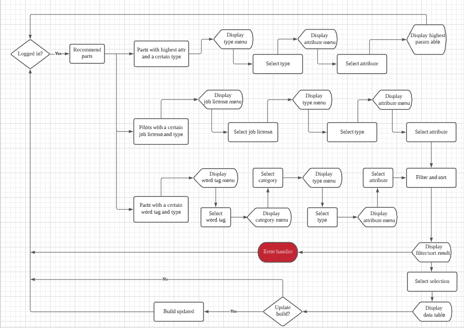

# T1A3 - GBM (Gundam Breaker Mobile) Helper

## Background information
Gundam Breaker Mobile (GBM) is a Japanese mobile game. Since its release in July 2019, more than 250 mobile suits have been introduced to the game, each with collectable parts such as head, body, arm, leg, backpack, weapon, and shield to allow players to build their customised mobile suits to clear missions.

## Purpose of GBM Helper
Gundam Breaker Mobile provides a large number of collectible parts with different stats, active skills, and passive skills which makes building a good mobile suit a challenging and time-consuming task for its players. The [Dengeki Wiki Japan](https://wiki.dengekionline.com/gbm/) even though has details of all the parts, only offers a sort feature, players will need to go back and forth to view the stats and skills that each part provides. GBM Helper aims to provide assistance to the players of Gundam Breaker Mobile by including:
* a login/sign-up feature to allow users to retrieve their current build and access other features upon successful login
* a view current build feature to allow users to view the parts they are currently using, sum up the value of each attribute and display them in a table
* a reset feature to allow users to start a new build from scratch
* a search feature to allow users to search for a certain part by its name, users then can view the details of the part
* a filter feature to allow users to focus on a certain category (e.g. arm)
* a sort feature to allow users to sort parts by a certain attribute (e.g. melee attack) then display the top 5 parts
* a recommendation feature which has been broken into three parts to help users find the right pilot and word tags to improve their build.

Gundam Breaker Mobile now has a Japanese version and a global version which includes language options of English, Chinese, and Korean. GBM Helper will first look to assist users who are playing the English version until the app supports other language options. Users will be able to log into the GBM Helper to view their current build, if there is a part that they know will imporve their build, they can use the search feature to search for the part and update their build. Otherwise, they can take advantage of the filter/sort feature and recommendation feature to find ideas on how to improve their build, and they will be able to overwrite their existing build.

## Installation
If you haven't installed Ruby

[https://www.ruby-lang.org/en/documentation/installation/](https://www.ruby-lang.org/en/documentation/installation/)

To clone the project
```
git clone https://github.com/noe13hsu/T1A3---GBM-Helper.git
```
**Inside your terminal to install the required gems**

if you don't have the bundler gem
```
gem install bundler
bundle install
```
or
```
./install.sh
```
if you have already installed the bundler gem
```
bundle install
```
or to install the gems separately
```
gem install colorize
gem install tty-table
gem install tty-prompt
gem install lolize
gem install ruby_figlet --no-rdoc --no-ri
```
## Usage
**Inside your terminal to run GBM Helper**

```
ruby app.rb
```
or
```
./execute.sh
```
Please note if you run GBM Helper with ./execute.sh in Windows, it is possible that the arrow keys won't work....

## Interaction
To find out how to interact with the features inside terminal
```
ruby app.rb -h
```
To find out the version number in terminal
```
ruby app.rb -v
```
Here is a brief summary....

This GBM Helper can help players of Gundam Breaker Mobile imporve their build with features such as:"
- View my current build:
        The parts a user is currently using will be displayed in a table and the value of each attribute will be summed up.
- Start a new build:
        ONLY if a user want to start a new build from scratch"
- Search parts by name:
        If a user knows what he/she is looking for, he/she can simply search for it by name.
        If the part is altered, users need to puy altered in front of the Gundam name in their search.
- Filter and sort parts:
        If a user is not sure what to use, he/she can try this filter by category and sort by attribute feature to find parts. For example, if a user is looking for more shot attack, he or she can try to filter a category then sort the parts by shot attack.
- Ger a build recommendation:

    * I am looking for parts with the highest attribute and a certain type:
        This can be a good place to for anyone to start your build or finalise their build. The part with the higheset attribute in each category will be displayed in a table.
    * I am looking for pilots with a certain job license and type:
        This feature can help users find the right pilot for their customised Gundam. If a user is building a fighter, he/she might want to choose either In-Fighter or Out-Fighter.If a user is building a Shooter, he/she might want to choose either Middle-Shooter or Long-Shooter.
    * I am looking for parts with a certain word tag and type:
        Word tags when activated can improve users' attributes. This feature will quickly help them find the parts with the right word tags.
- Log out:
        A build is ONLY saved when users log out.

## Error handling
This helper app relies on users' input to filter and sort parts' data before sending the result to methods to display tables, so errors can happen when the filtering and sorting does not find any result to pass to the methods. Error handlers have been implemented throughout the app but it is likely that there are still errors that might have been overlooked. Here are some other error handlers:
1. If an user starts the app without installing the required gems, a message will be displayed to alert the user and the app will stop
2. when loggin in, if incorrect credentials are entered, a message will be displayed and the user will be redirected back to the title menu
3. Username and password validation have also been implemented.


## Screen shots of control flow diagram

**Title menu**


**MVPs**




## Implementation plan
* create a control flow diagram by 2 April, high priority
* create a csv file to store user details by 3 April, high priority
* create csv files to store parts information by 3 April, high priority
* create a login/sign-up feature by 3 April, high priority, MVP
* create a reset feature by 4 April, high priority, MVP
* create a update build feature by 5 April, high priority
* create a search feature by 5 April, high priority, MVP
* create a filter/sort feature by 6 April, high priority, MVP
* use the colorize gem to change the text colour of a higher attribute to blue and a lower attribute to red by 7 April, low priority
* create a method to sum up each attribute based on user's current build by 8 April, medium priority, MVP
* create a method to calculate build type based on user's current build by 8 April, medium priority
* create a recommendation feature by 9 April, high priority, MVP
    
    * create a method to display the parts with a higheset attribute of a certain type by 8 April, high priority
    * create a method to filter pilots by a certain job license and display the result by 9 April, high priority
    * create a method to filter parts by a certain word tag and display the result by 9 April, high priority
* create a username/password validation method by 9 April, low priority
* create a method to get job licenses from pilots by 9 April, low priority
* create a method to calculate word tags based on user's current build by 9 April, medium priority
* design a colourful title the app by 10 April, low priority
* create slide deck by 10 April, low priority

Please see [my Trello board](https://trello.com/b/qXOb5Gb3/gbm-helper)


## Referenced sources
* [Dengeki Wiki](https://g-b-en.ggame.jp/wiki/)
* [Dengeki Wiki Japan](https://wiki.dengekionline.com/gbm/)
* The global version of Gundam Breaker Mobile (Gundam Battle: Gunpla Warfare)

## GitHub link
[https://github.com/noe13hsu/T1A3---GBM-Helper](https://github.com/noe13hsu/T1A3---GBM-Helper)

